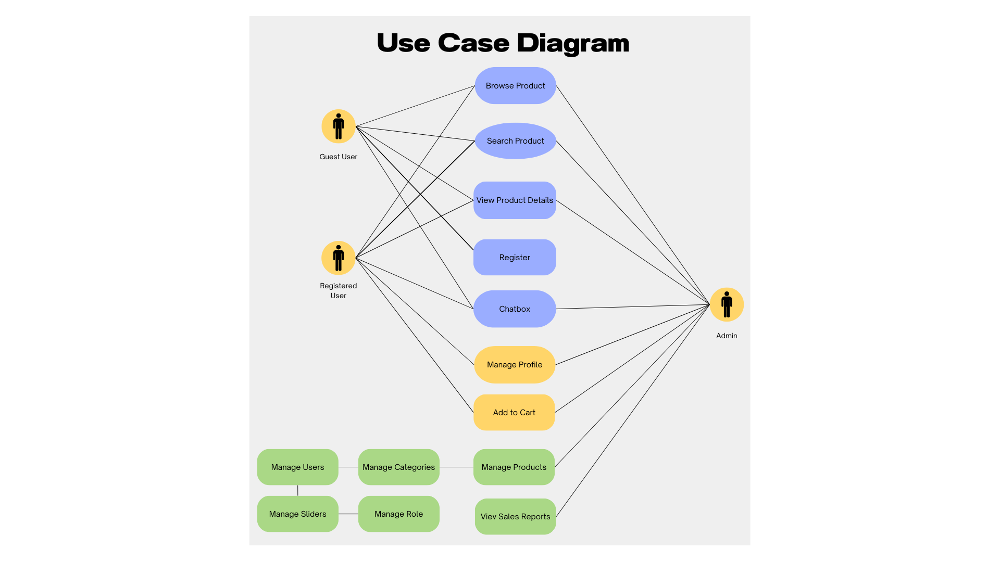
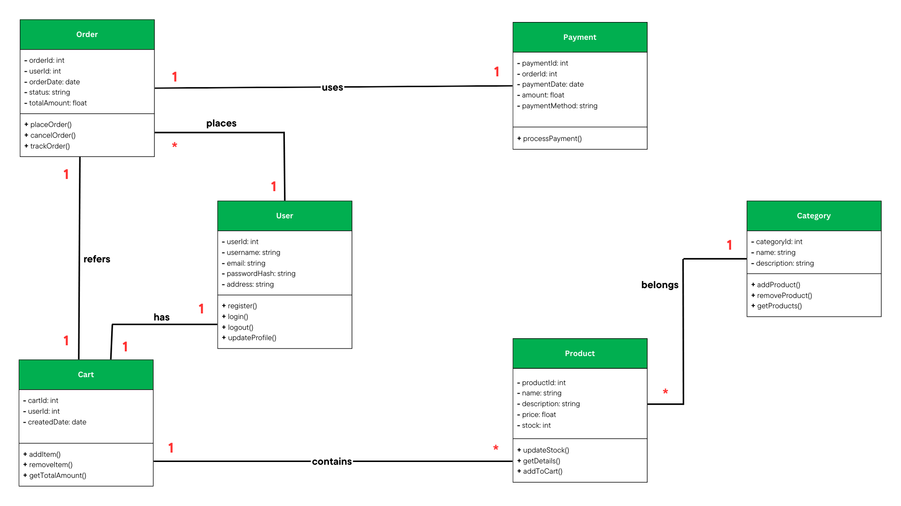
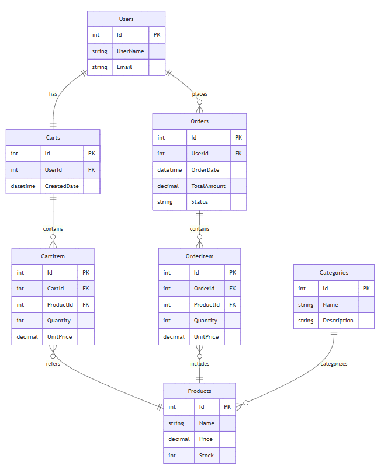
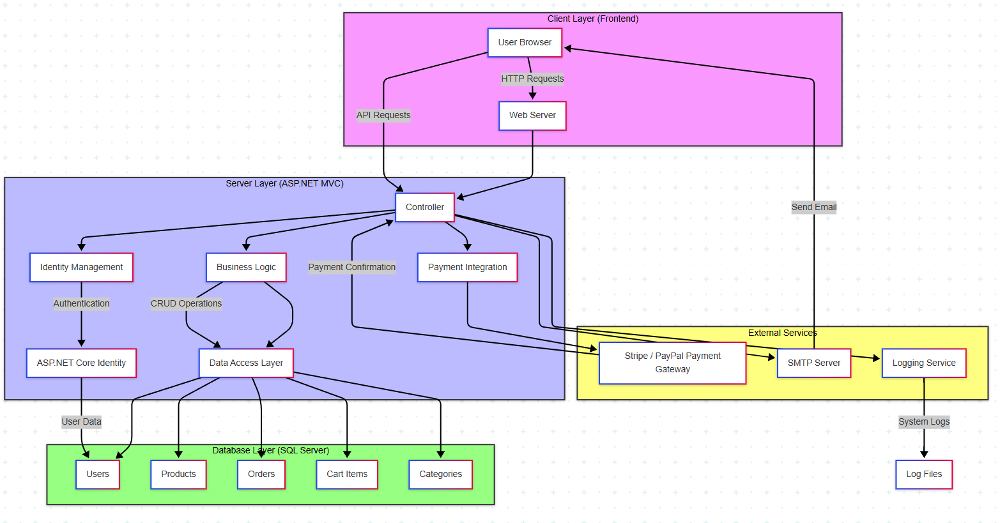

# TechMarkt - Tech Shopping Web Application

A modern e-commerce platform designed specifically for technology products, built with ASP.NET Core MVC and featuring comprehensive admin management capabilities.

## 🎯 Purpose

This document defines the functional and non-functional requirements for the TechMarkt shopping web application. It serves as a guide for developers, stakeholders, and testers to ensure alignment on project scope, features, and technical specifications.

## 🔍 Project Scope

The TechMarkt application provides:

- **User Experience**: Browse, search, and purchase tech products with an intuitive interface
- **Admin Management**: Comprehensive admin panel for managing products, users, and orders
- **Security**: Secure authentication and payment processing integration
- **Responsiveness**: Optimized experience across desktop, tablet, and mobile devices

## 🛠️ Technologies Used

### Backend
- **Framework**: ASP.NET Core MVC
- **ORM**: Entity Framework Core
- **Database**: Microsoft SQL Server with Code-First Migration
- **Authentication**: ASP.NET Identity (Role-based)

### Frontend
- **Views**: ASP.NET MVC Razor Views
- **Styling**: HTML5, CSS3, Bootstrap 5
- **Interactivity**: JavaScript
- **Responsive Design**: Bootstrap responsive grid system

### Integration & Tools
- **API**: RESTful Web Services
- **Development**: Visual Studio
- **Project Management**: Trello
- **Communication**: Slack

## 🏗️ System Architecture

The application is a standalone e-commerce platform that integrates with RESTful APIs for product data management. It follows the MVC architectural pattern with Entity Framework for database operations and MSSQL for data persistence.

## ✨ Key Features

### 🔐 User Authentication
- Secure user registration and login system
- Password recovery functionality
- Role-based access control using ASP.NET Identity

### 🛍️ Product Browsing
- Browse products by category and price range
- Advanced search with keyword filtering
- Real-time filtering capabilities
- Product favorites system

### 👨‍💼 Admin Dashboard
- **Product Management**: Complete CRUD operations for products and categories
- **User Management**: View user activities and manage user access
- **Order Management**: Track and update order statuses
- **Content Management**: Manage homepage sliders and promotional content

### 🛒 Cart & Checkout
- Add/remove items with quantity adjustment
- Secure checkout process
- Payment integration (Stripe-ready)
- Order confirmation system

### 📦 Order Tracking
- Real-time order status updates
- Status progression: Processing → Shipped → Delivered
- Order history for users

### 📱 Responsive Design
- Mobile-first approach using Bootstrap 5
- Optimized UI for all device sizes
- Touch-friendly interface elements

### 📊 Sales Analytics
- Generate comprehensive sales reports
- Revenue trend tracking
- User activity monitoring
- Performance metrics dashboard.

## 🎭 User Roles & Capabilities

### Customer Features
- Product browsing with advanced filters
- Shopping cart management
- Secure checkout process
- User account management
- Order tracking and history
- Product favorites list

### Admin Features
- Complete product catalog management
- User account oversight and management
- Order processing and status updates
- Sales analytics and reporting
- Content management (sliders, promotions)
- System monitoring capabilities

### 🗂️ System Diagrams

## Use Case Diagram

## UML Class Diagram

## Entity Relationship Diagram

## Architectural Diagram

## 🚀 Getting Started

### Prerequisites
- Visual Studio 2022
- .NET 9.0
- SQL Server (LocalDB or full instance)

### Installation
1. Clone the repository
2. Open the solution in Visual Studio
3. Update the connection string in `appsettings.json`
4. Run Entity Framework migrations
5. Build and run the application

### Configuration
- Database connection strings
- Payment gateway settings (Stripe)
- Email service configuration
- Authentication settings

## 🤝 Contributing

Guidelines for contributing to the TechMarkt project:
1. Fork the repository
2. Create a feature branch
3. Make your changes
4. Submit a pull request

## 📄 License

This project is licensed under the MIT License. See the `LICENSE` file for details.

## 📞 Support

- **Email**: mehmetemingocen18@gmail.com
- **Web**: [mehmetemingocen.com.tr](https://www.mehmetemingocen.com.tr/)
- **GitHub Issues**: [Issues page](https://github.com/mehmetemingocen/TechMarkt-Web-App/issues)

## 🙏 Thanks

Thanks to all the contributors who helped us develop this project!

---

**⭐ If you like this project, don’t forget to give it a star!**
